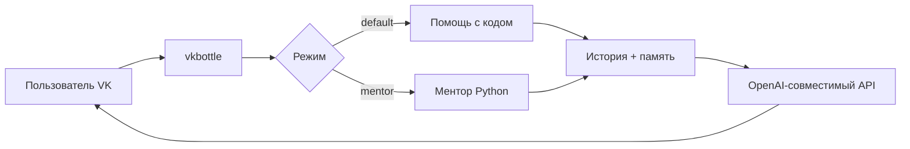

# VK AI Bot Advanced

AI-помощник по программированию для ВКонтакте: помогает с кодом, обучает Python в режиме ментора и запоминает сведения о пользователе.

Бот работает в личных сообщениях сообщества, поддерживает контекст текущего диалога и использует сохранённые факты о пользователе при формировании ответов.

---

## Возможности

* **Помощь с кодом** — разобрать ошибку, написать функцию или объяснить фрагмент кода.
* **Режим ментора** — объяснять Python простыми словами и по шагам.
* **История диалога** — учитывать последние 10 сообщений текущего диалога.
* **Долгосрочная память** — сохранять факты о пользователе в `user_memory.json`.
* **Клавиатура VK** — главное меню и быстрый доступ к основным функциям.
* **Очистка памяти** — удалить сохранённые факты и историю текущего диалога.
* **Обработка ошибок LLM** — показать понятное сообщение, если AI временно недоступен.
* **Команды** — `/start`, `/help`, `/about`, `/mentor`, `/remember`, `/memory`.

---

## Как это выглядит

```text
👋 Привет! Я AI-Помощник по программированию.

🐍 Учить Python          — обучение и объяснения

💡 Помочь с кодом        — задача, ошибка или готовый код

🧠 Запомнить обо мне     — сохранить сведения о себе

ℹ️ Возможности и примеры — информация о функциях бота

🧹 Очистить память       — удалить факты и историю

🏠 Главное меню          — вернуться к стартовому экрану
```

Примеры запросов:

| Режим  | Пример                                 |
| ------ | -------------------------------------- |
| Ментор | `Что такое список в Python?`           |
| Ментор | `Почему появляется NameError?`         |
| Код    | `Напиши функцию для сортировки списка` |
| Память | `Запомни, что я изучаю Python`         |

---

## Архитектура



Основные файлы:

| Файл               | Назначение                                                     |
| ------------------ | -------------------------------------------------------------- |
| `bot.py`           | Точка входа: меню, режимы, команды, промпты и запросы к модели |
| `history.py`       | Краткосрочная история текущего диалога в памяти программы      |
| `memory.py`        | Работа с долгосрочными фактами пользователя                    |
| `.env`             | Токены и настройки модели, не публикуется в Git                |
| `.env.example`     | Пример переменных окружения                                    |
| `requirements.txt` | Зависимости проекта                                            |

История диалога хранится только в памяти запущенной программы и очищается после её перезапуска. Долгосрочные факты сохраняются в `user_memory.json`.

---

## Требования

* Python 3.12+
* Сообщество ВКонтакте
* включённые сообщения сообщества
* VK Long Poll API
* ключ доступа сообщества с необходимыми правами
* API-ключ ProxyAPI или другого OpenAI-совместимого провайдера

---

## Быстрый старт

Клонировать репозиторий:

```bash
git clone https://github.com/lotusrussia-commits/vk-ai-bot-advanced.git
cd vk-ai-bot-advanced
```

Создать виртуальное окружение:

```bash
python3 -m venv .venv
```

Активировать его:

```bash
source .venv/bin/activate
```

Установить зависимости:

```bash
pip install -r requirements.txt
```

Создать `.env`:

```bash
cp .env.example .env
```

Заполнить `.env`:

```env
VK_TOKEN=ваш_токен_сообщества
PROXYAPI_TOKEN=ваш_API_ключ
PROXYAPI_BASE_URL=https://api.proxyapi.ru/openai/v1
AI_MODEL=название_выбранной_модели
```

Запустить бота:

```bash
python bot.py
```

После запуска можно открыть диалог с сообществом и отправить:

```text
/start
```

---

## Настройка ВКонтакте

1. Создать сообщество или открыть существующее.
2. Перейти в **Управление → Работа с API → Ключи доступа**.
3. Создать ключ доступа с правом работы с сообщениями сообщества.
4. Включить сообщения сообщества.
5. Включить **Long Poll API**.
6. Включить получение событий, связанных с входящими сообщениями.
7. Скопировать ключ доступа в `.env`.

Токен VK не должен публиковаться в GitHub.

Файл `.env` добавлен в `.gitignore`.

---

## Переменные окружения

| Переменная          | Назначение                          |
| ------------------- | ----------------------------------- |
| `VK_TOKEN`          | Ключ доступа сообщества VK          |
| `PROXYAPI_TOKEN`    | API-ключ LLM-провайдера             |
| `PROXYAPI_BASE_URL` | Базовый URL OpenAI-совместимого API |
| `AI_MODEL`          | Используемая модель                 |

Клиент создаётся через SDK `openai` и отправляет запросы на указанный `base_url`.

Модель можно изменить через `AI_MODEL`, не меняя код бота.

---

## Команды и кнопки

### Клавиатура

| Кнопка                   | Действие                                 |
| ------------------------ | ---------------------------------------- |
| 🐍 Учить Python          | Включает режим Python-ментора            |
| 💡 Помочь с кодом        | Помощь с конкретной задачей или ошибкой  |
| 🧠 Запомнить обо мне     | Сохранение информации о пользователе     |
| ℹ️ Возможности и примеры | Описание возможностей бота               |
| 🧹 Очистить память       | Удаляет факты и историю текущего диалога |
| 🏠 Главное меню          | Возврат в главное меню                   |

### Текстовые команды

| Команда            | Действие                             |
| ------------------ | ------------------------------------ |
| `/start`           | Приветствие и главное меню           |
| `/help`            | Главное меню и справка               |
| `/about`           | Краткая информация о боте            |
| `/mentor`          | Включить режим ментора               |
| `/mentor <вопрос>` | Сразу задать вопрос в режиме ментора |
| `/remember <факт>` | Сохранить факт о себе                |
| `/memory`          | Показать сохранённые факты           |

Также можно использовать обычную фразу:

```text
Запомни, что я изучаю Python
```

---

## Режим «Учить Python»

В этом режиме бот работает как Python-ментор для начинающего разработчика.

Он старается:

* объяснять сложные темы простыми словами;
* разбирать ошибки пошагово;
* приводить небольшие примеры кода;
* учитывать контекст предыдущих сообщений.

Например:

```text
Что такое список в Python?
```

А затем:

```text
А как добавить в него элемент?
```

История диалога позволяет боту понять, что речь идёт о списке.

---

## Помощь с кодом

Режим **«💡 Помочь с кодом»** предназначен для конкретных практических задач.

Например:

```text
У меня ошибка TypeError в Python. Объясни, что произошло.
```

или:

```text
Напиши функцию, которая находит максимальное число в списке.
```

В этом режиме бот не переключается в учебный формат ментора, если пользователь сам этого не запросил.

---

## Память

В проекте используются два вида памяти.

### Краткосрочная память

История текущего диалога хранится в оперативной памяти программы.

В неё попадают последние 10 сообщений пользователя и ассистента.

Это позволяет сохранять контекст разговора:

```text
Что такое список в Python?

А как добавить в него элемент?
```

После перезапуска бота история текущего диалога очищается.

### Долгосрочная память

Отдельно бот может сохранять факты о пользователе.

Например:

```text
Запомни, что я изучаю Python
```

После этого сохранённые факты можно посмотреть:

```text
/memory
```

Факты хранятся локально в:

```text
user_memory.json
```

Этот файл добавлен в `.gitignore`, поэтому пользовательские данные не отправляются в GitHub.

### Очистка памяти

Кнопка **🧹 Очистить память** удаляет:

* сохранённые факты пользователя;
* историю текущего диалога.

---

## Стек

* [VKBottle](https://github.com/vkbottle/vkbottle) — фреймворк для создания VK-ботов
* [OpenAI Python SDK](https://github.com/openai/openai-python) — клиент для работы с OpenAI-совместимым API
* [python-dotenv](https://github.com/theskumar/python-dotenv) — загрузка переменных окружения
* Python 3.12
* ProxyAPI / OpenAI-совместимый API

---

## Структура проекта

```text
vk-ai-bot-advanced/
├── bot.py
├── history.py
├── memory.py
├── requirements.txt
├── .env.example
├── .gitignore
└── README.md
```

---

## Если что-то пошло не так

### Бот не отвечает

Проверь:

* включены ли сообщения сообщества;
* включён ли Long Poll;
* правильно ли указан `VK_TOKEN`;
* запущен ли `python bot.py`.

### AI не отвечает

Проверь:

* `PROXYAPI_TOKEN`;
* `PROXYAPI_BASE_URL`;
* значение `AI_MODEL`;
* сообщение об ошибке в терминале.

При ошибке LLM бот показывает пользователю понятное сообщение вместо завершения работы.

### История пропала после перезапуска

Это нормальное поведение.

История текущего диалога хранится в RAM и очищается при перезапуске программы.

Долгосрочные факты должны сохраняться в `user_memory.json`.

---

## VK-сообщество

**AI-Помощник по программированию**

https://vk.ru/club241396776

---

## GitHub

https://github.com/lotusrussia-commits/vk-ai-bot-advanced

---

## Результат

В результате получился VK-бот с подключением LLM, несколькими режимами работы, обучающим режимом Python-ментора, краткосрочной историей диалога и долгосрочной памятью пользователя.

Проект выполнен в рамках продвинутого варианта домашнего задания курса «Профессия вайб-кодер».
